El proyecto se basará en la gestión de la base de datos de clientas para una clínica de matronas, que se llamará mismatronas.com, proyecto que en un futuro se puede convertir en real, proviene de una idea de negocio que tiene una amiga y que me ha propuesto para llevarle a cabo tanto la aplicación de gestión del centro, como la web. En este proyecto nos basaremos ahora mismo únicamente a la aplicación implementada en web.

Portada de la Aplicación:
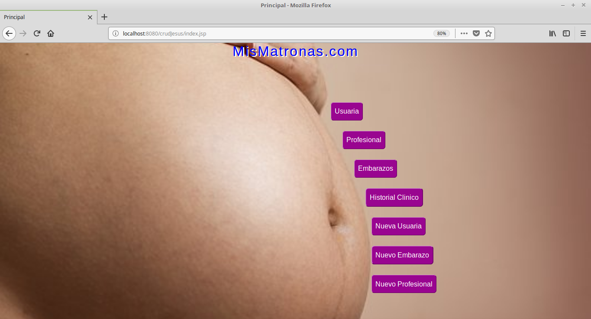
Tabla de Usuarias:
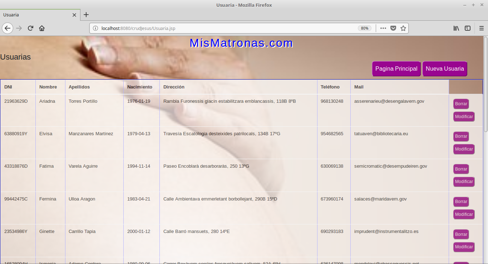
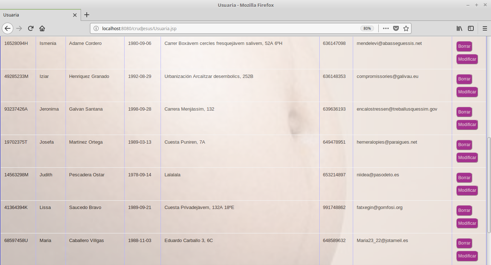
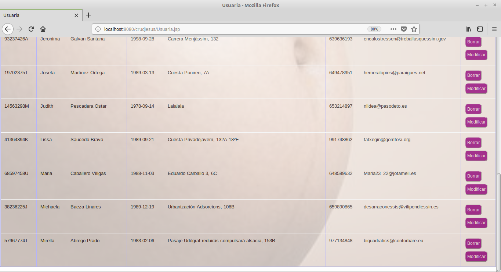
Tabla de Profesionales:
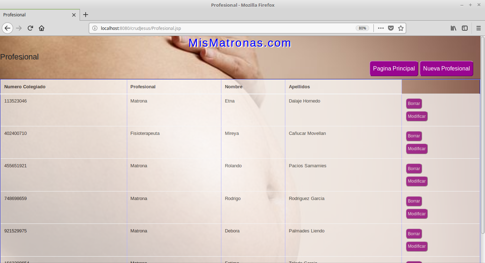
Tabla de Embarazos:
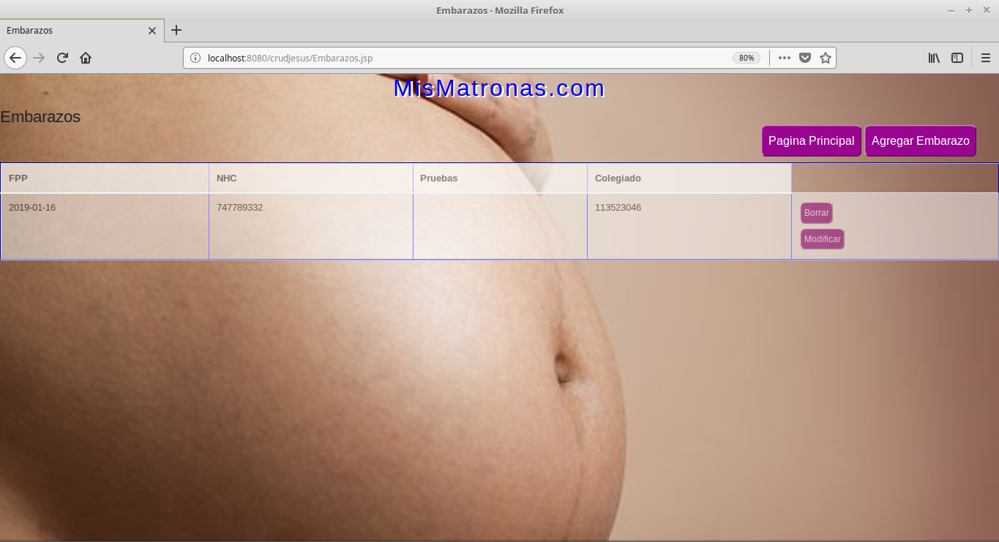
Tabla del Historial Clinico:
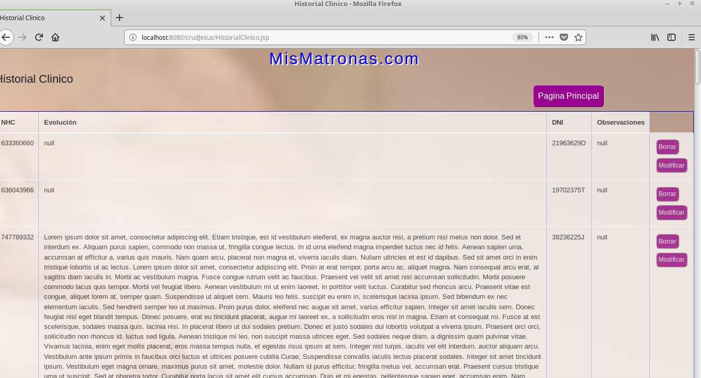
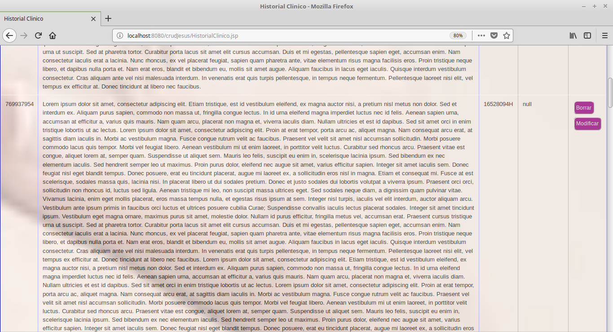
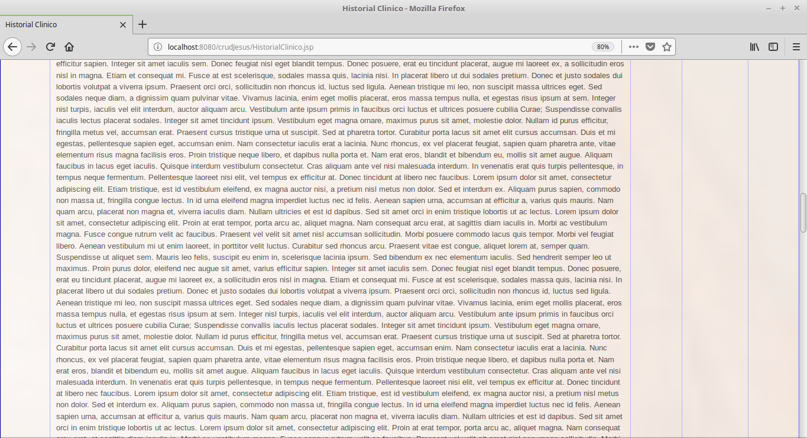
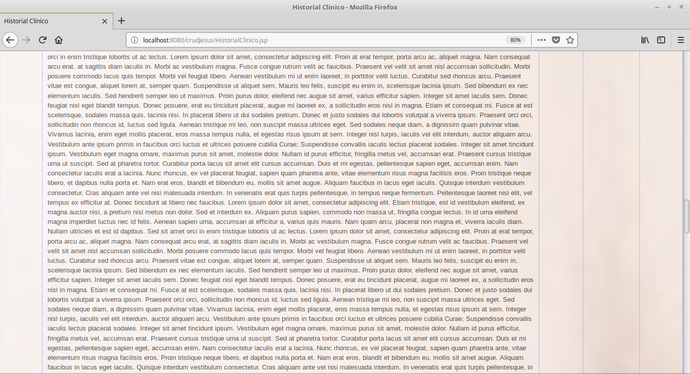
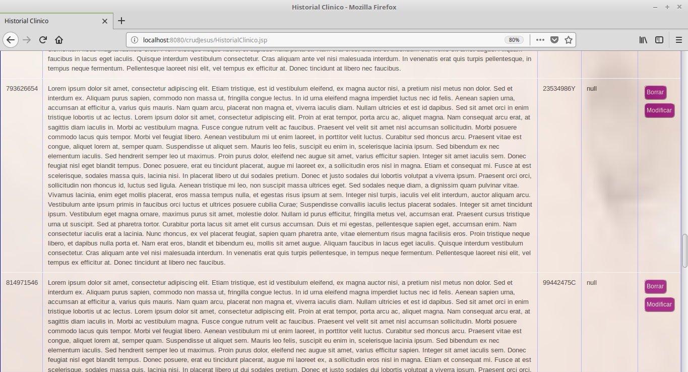
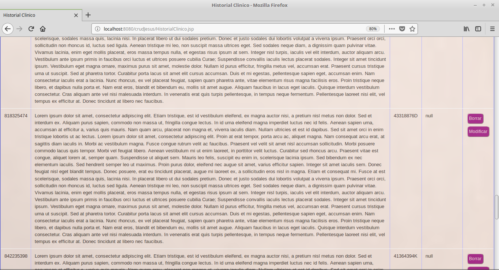
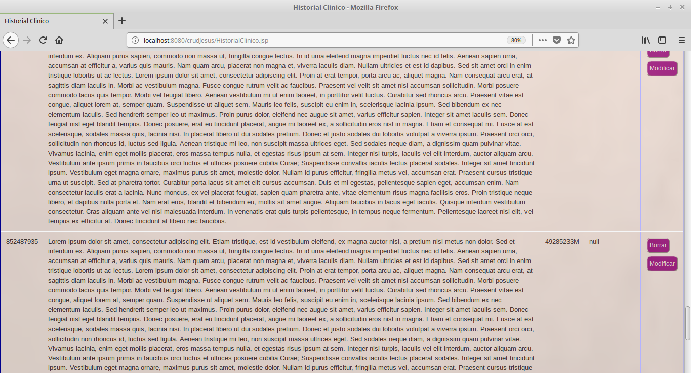
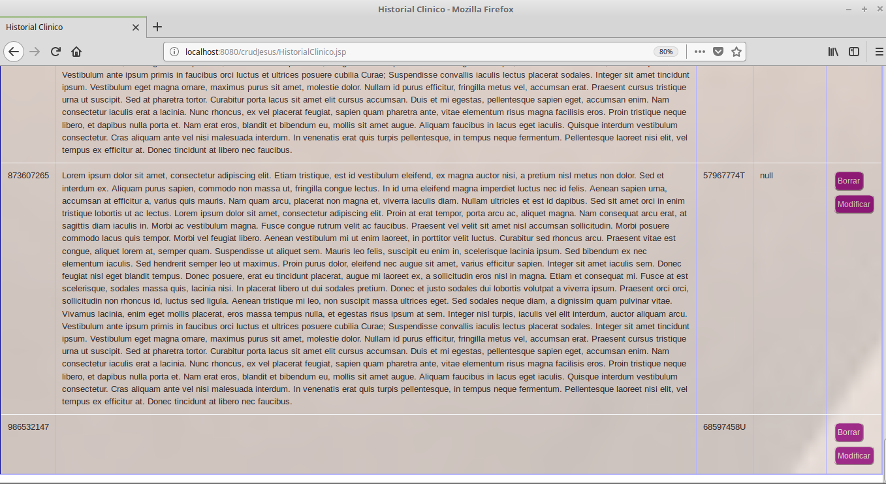
Agregando Usuarias:
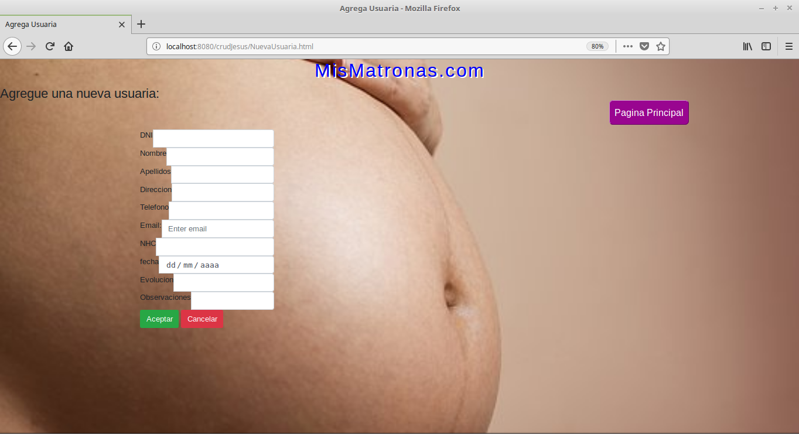
Agregar Embarazos:
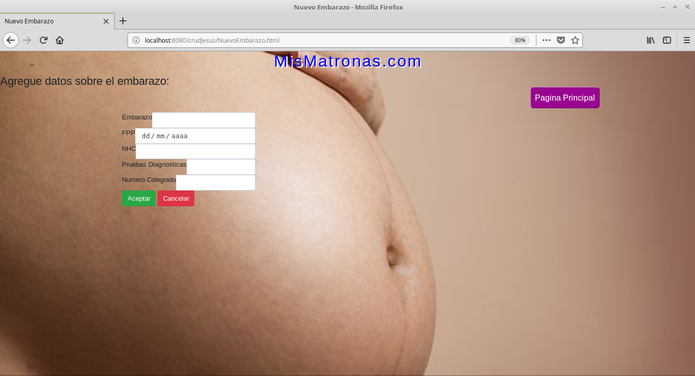
Agregar_Profesional
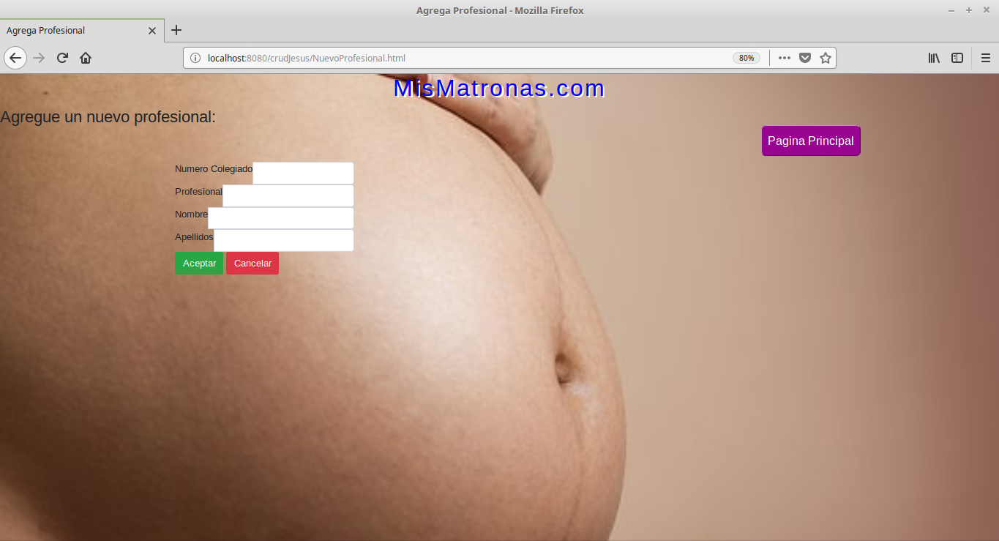
